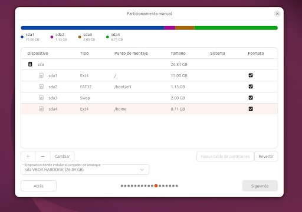
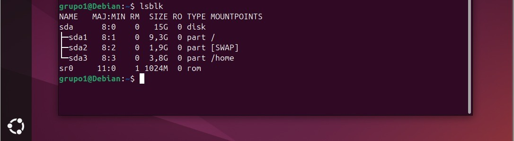
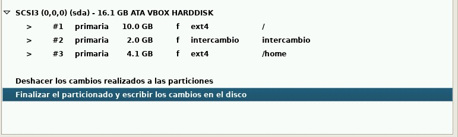
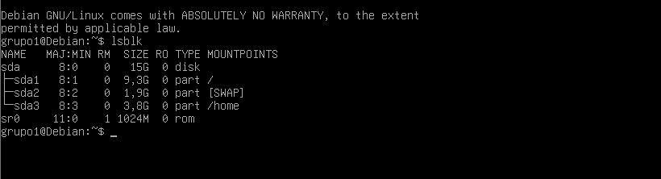
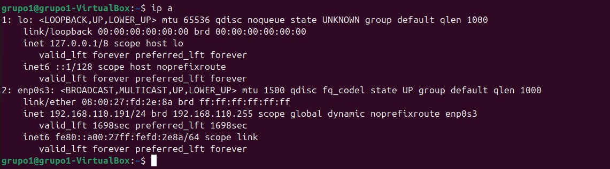
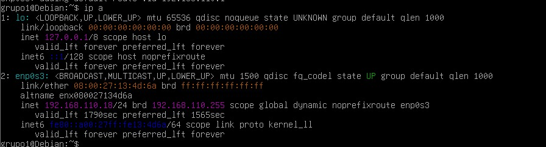
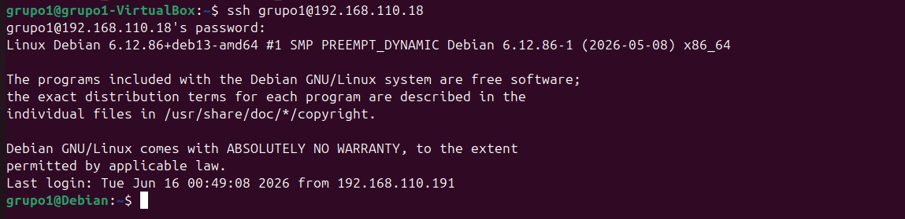

# Proyecto Final — Arquitecto Cloud
**Sistemas Operativos 750001C | Semestre 1 – 2026**
**Universidad del Valle**

---

## Equipo

| Nombre | Código | Rol |
|--------|--------|-----|
| Alejandro Borrero | 202560904 | Virtualización + Sitio Web + Documentación |
| Juan José Lozano | 2560998 | Docker + Sitio Web + Documentación |
| Camila Mallama | 2560968 | Kubernetes + Sitio Web + Documentación |

**Grupo asignado:** Grupo 1  
**Distribución gráfica:** Ubuntu 24.04 LTS  
**Distribución consola:** Debian 13.5  
**Imagen Docker base:** ubuntu:24.04

---

## Componente 1: Virtualización con Linux

**Distribuciones instaladas:** VM Gráfica (Ubuntu 24.04 LTS) + VM Consola (Debian 13.5)  
**Herramienta:** VirtualBox

### Evidencias

#### Particionado Ubuntu



#### Particionado Ubuntu — Evidencia



#### Particionado Debian



#### Particionado Debian — Evidencia



#### Configuración de red — Ubuntu



#### Configuración de red — Debian



#### Conexión SSH



### Comandos principales
```bash
ip a                          # Ver interfaces de red
lsblk                         # Ver particiones
ssh usuario@ip_vm_consola     # Conectar por SSH
```

---

## Componente 2: Contenedores Docker

**Servicios implementados:**
- Frontend: Nginx sirviendo HTML estático (puerto 80)
- Backend: Python HTTP (puerto 5000)

### Estructura de archivos
```
docker/
├── frontend/
│   ├── Dockerfile.frontend
│   └── index.html
├── backend/
│   ├── Dockerfile.backend
│   └── server.py
└── docker-compose.yml
```

### Evidencias

#### Versión de Docker


#### Dockerfile Frontend


#### Dockerfile Backend


#### Docker Compose — Parte 1


#### Docker Compose — Parte 2


#### Estructura de archivos (tree)


#### Construcción de contenedores — Parte 1


#### Construcción de contenedores — Parte 2


#### Imágenes Docker


#### Contenedores activos


#### curl al backend


#### Frontend en navegador


### Comandos principales
```bash
docker compose up -d
docker ps
docker images
curl http://localhost
curl http://localhost:5000
```

---

## Componente 3: Orquestación con Kubernetes

**Herramienta:** Minikube

### Manifiestos
- `deployment.yaml` — Nginx con 2 réplicas
- `service.yaml` — NodePort en puerto 30080

### Evidencias

#### Versión de kubectl


#### Nodos del clúster


#### Minikube iniciado


#### Pods con 2 réplicas


#### Servicio NodePort


#### URL del servicio


#### Nginx en navegador


#### Escalado a 3 réplicas


### Comandos principales
```bash
minikube start
kubectl apply -f deployment.yaml
kubectl apply -f service.yaml
kubectl get pods
kubectl scale deployment nginx --replicas=3
minikube service nginx --url
```

---

## Componente 4: Sitio Web de Documentación

**URL del sitio:** [https://juanlr-ing.github.io/Proyecto-Final-S.O---Grupo-1/](https://juanlr-ing.github.io/Proyecto-Final-S.O---Grupo-1/)  
**Video YouTube:** [https://youtu.be/E95nbS30v-k?si=GBAOPvTbYjz6v9L9](https://youtu.be/E95nbS30v-k?si=GBAOPvTbYjz6v9L9)

### Secciones del sitio
- **Home:** introducción y objetivos
- **Equipo:** integrantes con fotos y roles
- **Componentes:** descripción, capturas y comandos de cada uno
- **Conclusiones:** aprendizajes, dificultades y recomendaciones

---

## Diagrama de Arquitectura


---

## Conclusiones

1. **Aprendizaje principal**
   - **Juan José Lozano:** Lo más valioso fue entender Linux, los contenedores y GitHub como herramienta colaborativa.
   - **Alejandro Borrero:** Lo que más me gustó aprender fue crear y usar máquinas virtuales y GitHub como herramienta para trabajo en equipo.
   - **Camila Mallama:** Aprendí cómo Kubernetes permite administrar y escalar aplicaciones de forma más sencilla, especialmente mediante el uso de pods, deployments y servicios.

2. **Dificultad encontrada y cómo se resolvió**
   - **Juan José Lozano:** La mayor dificultad fue la instalación de Ubuntu, que se congelaba por falta de RAM en la VM. Al asignar más memoria se resolvió. Docker enseñó que la sintaxis debe ser precisa.
   - **Alejandro Borrero:** Sin dificultades mayores gracias a la investigación previa.
   - **Camila Mallama:** La mayor dificultad fue configurar Minikube y lograr que los pods se levantaran correctamente, ya que cualquier error en los manifiestos YAML hacía que el despliegue fallara.

3. **Recomendación para futuros proyectos**
   - **Recomendación común del Grupo 1:** Intenten realizar el proyecto con más tiempo para evitar dolores de cabeza, estrés y contratiempos. También recomendamos pedirle consejos al profesor sobre cualquier inconveniente que surja durante el desarrollo.

---

*Proyecto desarrollado para la asignatura Sistemas Operativos 750001C — Semestre 1, 2026*
